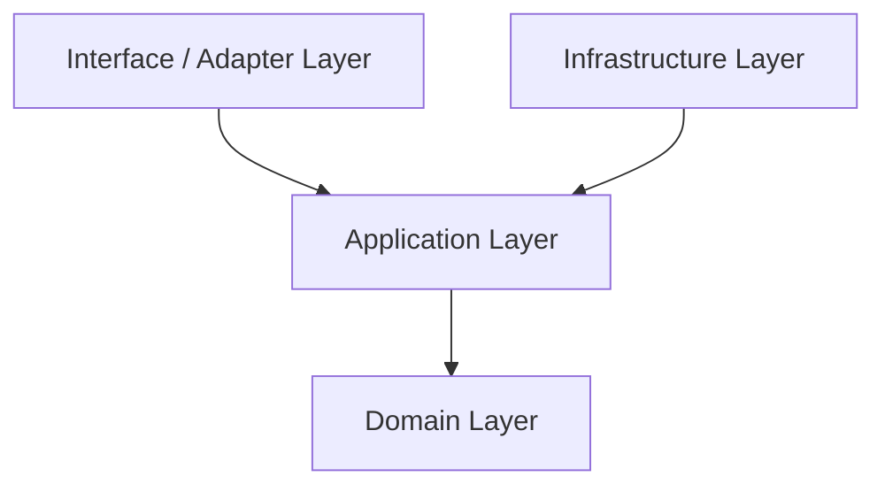

# Architecture & Design System

The `@pharos/cryptographic-contract-auditor` is engineered under strict **Clean Architecture** guidelines. This ensures a clean separation of concerns, decoupling our core business rules from external libraries, database mechanisms, and blockchain network clients.

---

## 🏗️ Layer Separation

The codebase is structured into four concentric layers, where dependencies point strictly inward:

### 1. Domain Layer (`src/domain/`)
The inner core of the application. It contains the business rules, entities, value objects, and repository ports (interfaces).
*   **Zero-Dependency Policy**: This layer has **no external imports** (no viem, no zod, no crypto libraries). All rules are verified using native TypeScript. This guarantees immunity to supply-chain attacks.
*   **Entities**:
    *   `ContractBytecode`: Holds and validates EVM bytecode hex strings.
    *   `HeuristicCheck`: Represents a specific security scan rule (passed/failed status, severity, description).
    *   `RiskScore`: Dynamically calculates risk score points based on severities of failed checks, capped at `100`.
    *   `AuditResult`: Holds the state of the audit and supports immutable attestation binding via `.attest()`.
*   **Value Objects**:
    *   `ContractAddress`: Validates EVM addresses and lowercase canonicalizes them.
    *   `AttestationHash`: Formats SHA-256 hash digests.
    *   `Signature`: Holds ECDSA-style signature structures.

### 2. Application Layer (`src/application/`)
Orchestrates the domain models and coordinates transaction flows.
*   **Use Case**: `AuditContractUseCase` coordinates fetching bytecode, running heuristics, calculating risk, and generating attestations.
*   **DTO (Data Transfer Object)**: Defines boundary validation contracts using `zod` for incoming requests and outgoing responses.

### 3. Infrastructure Layer (`src/infrastructure/`)
Contains concrete adapters that satisfy the domain interfaces.
*   `BasicHeuristicEngine`: Scans EVM hex code for opcodes.
*   `Sha256AttestationGenerator`: Serialization and SHA-256 hashing.
*   `MockBytecodeFetcher`: Helper for local unit tests and preset demo targets.

### 4. Interface / Adapter Layer (`src/interface/`)
Boundary adapters converting input parameters into the application formats.
*   `PharosSkillAdapter`: Wraps output payloads in the standard Pharos JSON envelope.
*   `cli.ts`: Entry point script accepting terminal command line arguments.
