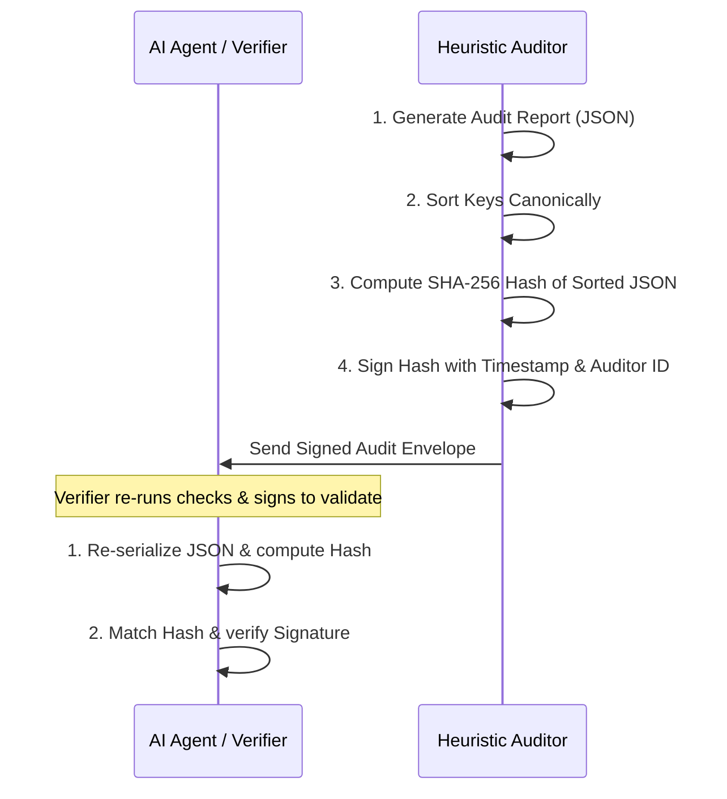

# Cryptographic Attestation Protocol

The `CrypCA` package ensures that audit results are tamper-proof and verifiable by downstream autonomous agents. This page details the exact cryptographic attestation protocol used to seal and verify audit outcomes.

---

## 🔒 Why Cryptographic Attestation?

Autonomous AI Agents execute financial operations based on data. If an agent queries an auditor, a malicious middleman could intercept the transmission and alter a `riskScore` from `75` (HIGH risk) to `0` (SECURE), tricking the agent into executing a dangerous transaction.

By sealing the audit result with a **cryptographic signature**, the auditor ensures:
1.  **Integritas (Data Integrity)**: The audit findings cannot be modified.
2.  **Otensitas (Auditor Authenticity)**: The agent can verify exactly which trusted auditor produced the report.
3.  **Non-Replay (Freshness)**: The audit cannot be intercepted and replayed for a different contract or at a later time when the contract's bytecode may have changed.

---

## ⚙️ The Attestation Workflow

The generation and verification of audit attestations follow a strict 4-step pipeline:



### 1. Canonical Serialization
JSON objects can be serialized differently across programming languages (e.g. key order variations). To guarantee that the computed hash is identical on any computer, the auditor serializes the JSON using **canonical key sorting**:

```typescript
// Sort keys alphabetically before stringifying
const canonicalString = JSON.stringify(
  auditResult, 
  Object.keys(auditResult).sort()
);
```

### 2. SHA-256 Hashing
The canonical string is hashed using the standard SHA-256 algorithm to produce a 32-byte hash digest represented as a 64-character hexadecimal string:

$$\text{hash} = \text{SHA256}(\text{canonicalString})$$

```typescript
import { createHash } from 'crypto';

const hash = createHash('sha256')
  .update(canonicalString)
  .digest('hex');
```

### 3. Binding to Auditor Identity and Time
To prevent a valid attestation of a clean contract from being re-used for a malicious one (replay attack), the auditor binds the hash to the `auditorId` and the exact `timestamp` of the audit:

$$\text{dataToSign} = \text{“SIGNATURE\_PREFIX\_”} + \text{hash} + \text{“\_”} + \text{auditorId} + \text{“\_”} + \text{timestamp}$$

```typescript
const timestamp = new Date().toISOString();
const payload = `SIGNATURE_PREFIX_${hash}_${auditorId}_${timestamp}`;

const signature = createHash('sha256')
  .update(payload)
  .digest('hex');
```

In production environments, this signature is signed using the auditor's ECDSA private key (using `secp256k1` or `ed25519`). Our local SDK implements a clean cryptographic signature simulation using secure hashing, which can be extended with `viem`'s local wallet signature methods.

---

## 🔍 Verification Protocol for Downstream Agents

Before executing a trade based on an audit report, a receiving agent must verify the attestation:

```typescript
function verifyAttestation(report: AuditReport): boolean {
  const { attestation, ...auditData } = report;
  
  // 1. Reconstruct canonical string
  const canonical = JSON.stringify(auditData, Object.keys(auditData).sort());
  
  // 2. Re-compute hash
  const computedHash = createHash('sha256').update(canonical).digest('hex');
  if (computedHash !== attestation.hash) {
    return false; // Integrity breach! Data was modified.
  }
  
  // 3. Re-verify signature binding
  const payload = `SIGNATURE_PREFIX_${computedHash}_${attestation.auditorId}_${attestation.timestamp}`;
  const computedSignature = createHash('sha256').update(payload).digest('hex');
  if (computedSignature !== attestation.signature) {
    return false; // Authentication breach! Signature is invalid.
  }
  
  // 4. Verify freshness (e.g. audit is less than 24 hours old)
  const auditTime = new Date(attestation.timestamp).getTime();
  const now = Date.now();
  if (now - auditTime > 24 * 60 * 60 * 1000) {
    return false; // Replay attack risk: Report is too old.
  }
  
  return true; // Audit is AUTHENTIC and SAFE.
}
```
