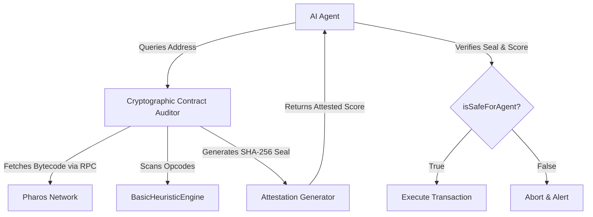

# Introduction

Welcome to the official documentation for `@pharos/cryptographic-contract-auditor` — a deterministic, heuristic-based smart contract security scanner built for the **Pharos AI Agent and on-chain economy**.

---

## 🔒 The Safety Challenge in the Agent Economy

In the emerging AI Agent economy, autonomous agents are tasked with executing financial transactions, providing liquidity, and routing swaps across decentralized finance (DeFi) protocols entirely without human intervention. 

This autonomy introduces a severe security risk: **malicious contracts**. Traditional scanners are designed for humans, and modern LLM (Large Language Model) auditors suffer from three critical flaws when used by autonomous agents:
1. **Hallucination**: LLMs can misinterpret EVM bytecode opcodes, generating false positives or failing to detect critical vulnerabilities.
2. **Tampering & Spoofing**: LLM outputs are returned as plain JSON/text. There is no cryptographic proof that the audit was genuinely performed by a trusted source and not modified in transit.
3. **Execution Latency**: Querying heavy LLM APIs introduces gas estimation delays and processing latency, which is unacceptable for fast-executing arbitrage or high-frequency trading agents.

---

## 💡 The Solution: Cryptographic Contract Auditor

`@pharos/cryptographic-contract-auditor` solves these challenges by combining **low-level, deterministic EVM bytecode heuristics** with **tamper-evident cryptographic attestations**.

By performing static opcode analysis on the client side, the audit is completed in **milliseconds** with **zero gas costs**. The audit result is then hashed canonically (SHA-256) and signed, creating a time-bound and auditor-bound seal. Any downstream agent can mathematically verify this attestation instantly to trust the audit results.

---

## 🗺️ The Dual Cascade Roadmap

This project is built to align with the two-phase hackathon vision:

*   **Phase 1 (The Skill)**: A highly reusable, composable TypeScript module and CLI package. It integrates seamlessly into `PharosAgentKit` and `LangChain` to provide security checks.
*   **Phase 2 (The Agent)**: The **Sentinel DeFi Agent**. An autonomous agent running in the Pharos Agent Arena. Before executing transactions, the Sentinel Agent calls this Skill. If the risk attestation reveals vulnerabilities (e.g. `SELFDESTRUCT` or `DELEGATECALL`), the agent halts execution, safeguarding liquidity pools.
